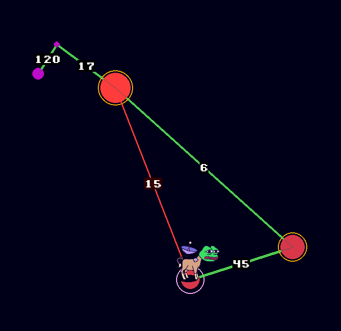

# Carechucho 🐐🥀

Explore different stars before your burro dies. Perform interesting research labors and eat grass like a true patriot.

## 🎮️ Running

Getting started is super simple:

    python main.py

Make sure you have the required dependencies installed first

## Docs

Understand this thing very easily with the online docs:  [Github Pages docs](https://alex461538.github.io/carechucho/)

## 📜 License

This project is licensed under the MIT license, do whatever you want with this trash. 🐤